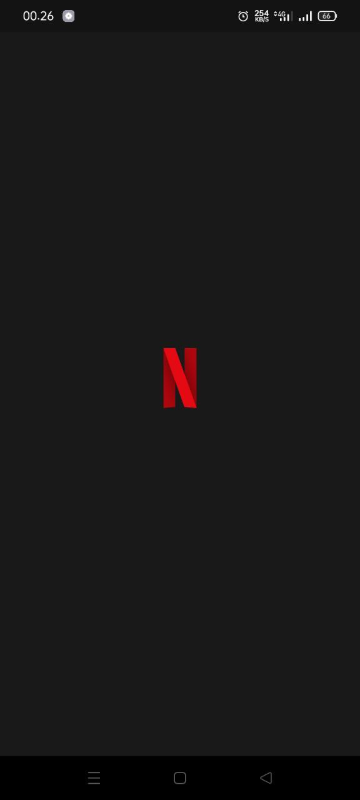
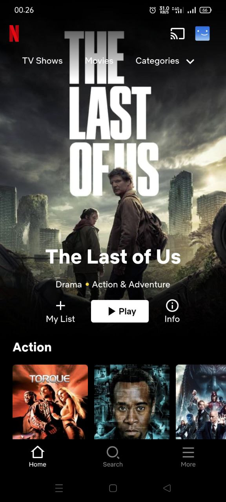
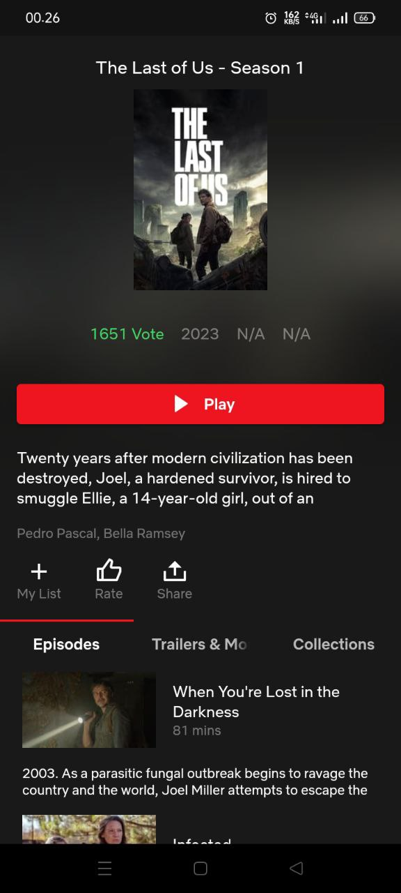
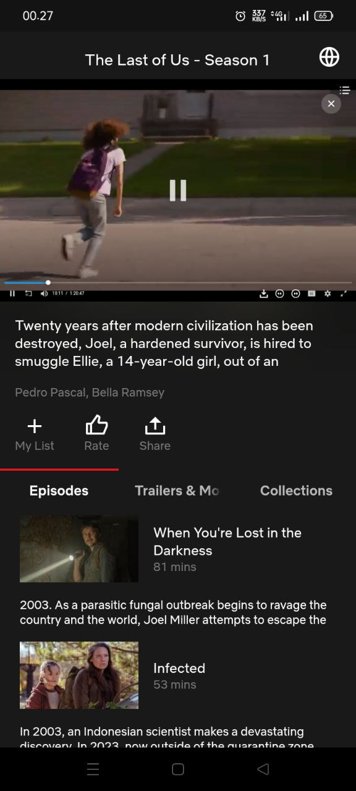
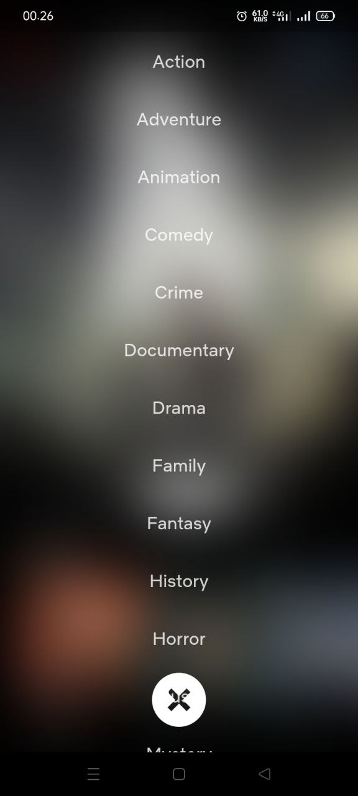
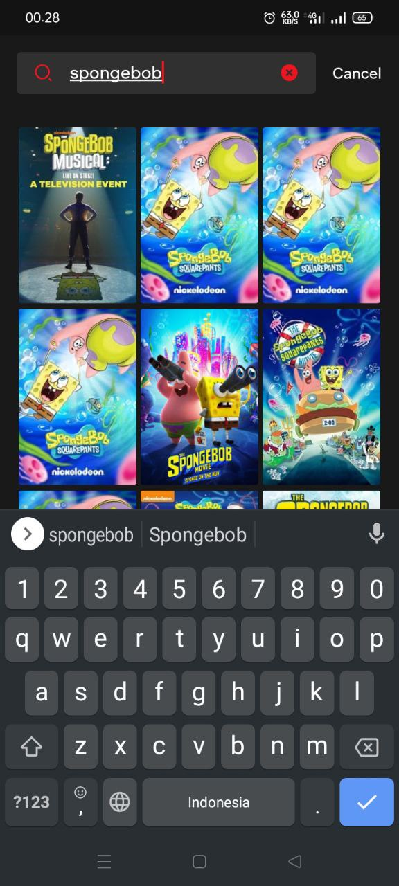

    
    <h1>Netflix</h1>
    
An Android application for streaming movies (*free)

---

  
  
  

  
  
  

## Features
- Play (almost) any movies
- Watch trailer
- View movies information
- Discover movies by genre and keyword
- Custom subtitle (\*only movies, series coming soon)
- Save to watchlist (coming soon)

## Installation

## Acknowledgments
- [**TMDB**](https://themoviedb.org): A website to get movie information details.
- [**Remix Icon**](https://remixicon.com): Premium hand-crafted icons built by Remix.

## Disclaimer
This project and its contents are not affiliated with, funded, authorized, endorsed by, or in any way associated with Netflix or any of its affiliates and subsidiaries.

\*For educational purpose only